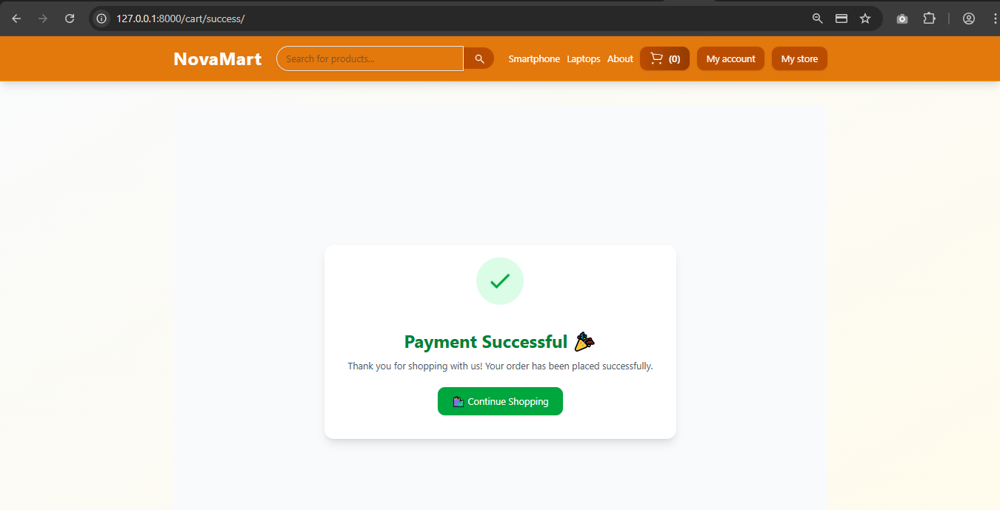

# 🛍️ NovaMart (Multi-Vendor E-commerce Website)


---

## 📖 About NovaMart
**NovaMart** is a **full-stack multi-vendor e-commerce platform** built with **Django** and **TailwindCSS**.  
It allows **customers** to browse, search, and purchase products while **vendors** can manage their own online stores.  
The platform integrates a **secure checkout process with Stripe payments** and provides a robust account management system.

---

## ✨ Features
- 👤 **User Authentication** – Sign up, log in, and manage accounts (customers & vendors).  
- 🛒 **Shopping Cart** – Add, update, and remove items before checkout.  
- 🔍 **Product Search & Categories** – Easily find products by name or category.  
- 🏬 **Vendor Dashboard** – Vendors can manage their products, inventory, and pricing.  
- 💳 **Stripe Payment Integration** – Secure online payments.  
- 📦 **Order Management** – Customers can track orders, vendors can process them.  
- 📂 **Media Handling** – Product images stored & served efficiently with WhiteNoise.  
- 📱 **Responsive Design** – Built with TailwindCSS for modern UI/UX.  

---

## 🛠 Tech Stack
- **Backend:** Django, Python  
- **Frontend:** HTML, TailwindCSS  
- **Database:** SQLite (local) / PostgreSQL (production-ready)  
- **Payments:** Stripe API  
- **Deployment:** Whitenoise, Gunicorn (ready for cloud deployment)  

---

## Screenshots

### 🏠 Home Page


### 📄 Product Description


### 🔍 Search Feature


### 🏬 My Store Feature


### 🛒 Cart Feature


### 📋 Checkout Form


### 💳 Payment Feature


### ✅ Success Page



## ⚡ Installation & Setup

1. **Clone the repository**
   ```bash
   git clone https://github.com/yourusername/NovaMart.git
   cd NovaMart

2. **Create & activate virtual environment**
   ```bash
   ### On Windows
   python -m venv venv
   venv\Scripts\activate

   ### On Mac/Linux
   python3 -m venv venv
   source venv/bin/activate

3. Install dependencies
   ```bash
   pip install -r requirements.txt

4. Run database migrations
   ```bash
   python manage.py makemigrations
   python manage.py migrate

5. Create superuser (for Django Admin)
   ```bash
   python manage.py createsuperuser

6. Collect static files
   ```bash
   python manage.py collectstatic

7. Start TailwindCSS (if using django-tailwind)
   ```bash
   python manage.py tailwind install

   python manage.py tailwind build

8. Run the development server
   ```bash
   python manage.py runserver

9. Open the app in your browser
    ```bash
   http://127.0.0.1:8000/
